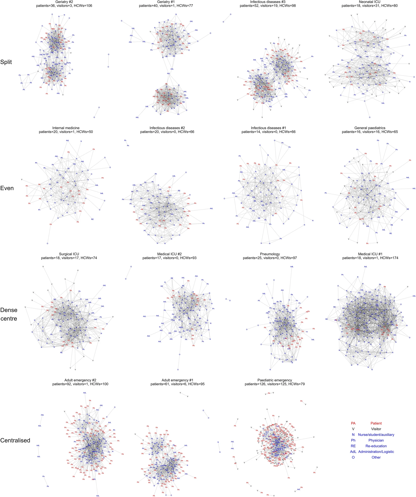
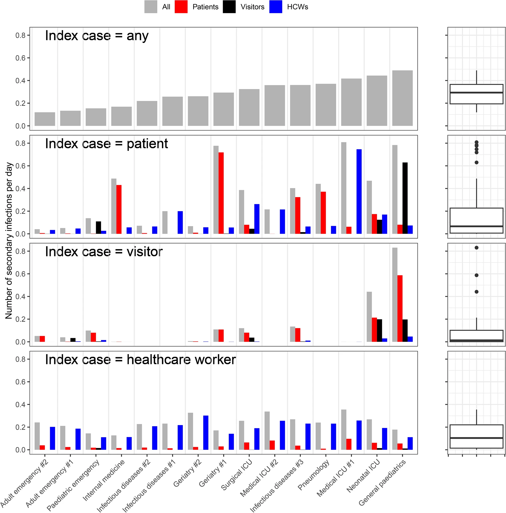
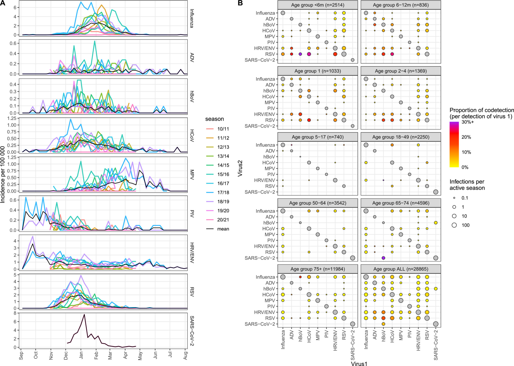
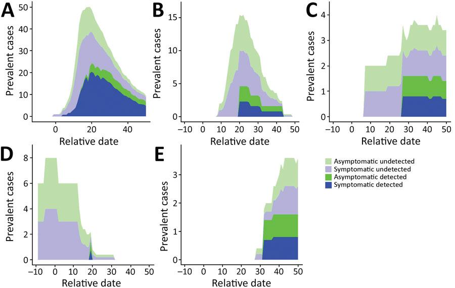

------------------------------------------------------------------------

## Hospital contact networks

:::::: {.columns .my-columns}
::: {.column width="30%"}

:::

::: {.column width="25%"}
As part of the nodscov2 project, I analysed data collected from portable sensors worn by hospital staff, patients and visitors over 36 hour periods in April-June 2020. We were able to reconstruct the contact networks between types of individuals present (left). This data were then used to inform a mathematical model of disease transmission and estimated epidemic risk which an infected staff member, patient or visitor would pose (right). <a href="http://doi.org/10.1038/s41598-023-50228-8">link</a>
:::

::: {.column width="40%"}

:::
::::::

------------------------------------------------------------------------

## Respiratory virus seasonality

::::: {.columns .my-columns}
::: {.column width="60%"}

:::

::: {.column width="40%"}
In collaboration with colleagues in Valencia, Spain, who collected 10 years of data on patients hospitalised with respiratory infection and who were then tested for a panel of viruses. I examined seasonality patterns for different viruses, and the extent of co-detection between pairs of viruses. We identified marked seasonality for some viruses (Influenza, RSV) but less seasonal pattern for rhinovirus/enterovirus (HRV/ENV) <a href="https://doi.org/10.1111/irv.70017">link</a>   \[ADV=adenovirus, hBoV=human bocavirus, HCoV=human non-SARS coronaviruses (229E, HKU1, NL63 and OC43), MPV=human metapneumovirus, PIV=human parainfluenza viruses (1–4), RSV=respiratory syncytial virus (A/B), HRV/ENV=rhino/enteroviruses (HRV/ENV), influenza viruses (A/B)\]
:::
:::::

:::::: {.columns .my-columns}
::: {.column width="20%"}
<h1 style="font-size:14px; font-weight:normal ">

(A) Seasonality trends for each virus, with seasons overlaid. Each row is a different virus, with colours representing seasons, and the black line showing the weekly mean incidence per virus.

</h1>
:::

::: {.column width="40%"}
<h1 style="font-size:14px; font-weight:normal ">

(B) The number of mono-detections and co-detections by age group and all ages combined. Each panel represents an age category, with the panel label indicating both the age and number of patients with valid tests. Size of points indicates average number of detections per active season (SARS-CoV-2 was considered active for one season, all other viruses for 10 seasons in ages \< 5 and 11 seasons otherwise) on a log scale. The diagonal represents the number of mono-detections, while the off-diagonal represent co-detections, with colour representing the proportion of detections of Virus1 that are co-detections (capped at 30%). The matrix is symmetrical for point size but not colour.

</h1>
:::

::: {.column width="40%"}
:::
::::::

------------------------------------------------------------------------

## Transmission of SARS-CoV-2 in a healthcare facility

:::::: {.columns .my-columns}
::: {.column width="30%"}

:::

::: {.column width="25%"}
In the early COVID-19 pandemic, I collaborated with a long-term care facility in Paris which had experienced a large outbreak of the infection. In order to estimate the basic reproduction number and to evaluate the effect of introducing a universal masking policy, I fitted a stochastic model which took into account the limited testing capacity as well as asymptomatic infection. Two separate models were fit to data, the first assuming a constant rate of transmission and the second assuming a change in transmission rate upon introduction of universal masking (left). We were able to use this to identify the number of cases which had gone undetected (right).\
<a href="http://doi.org/10.3201/eid2807.212339">link</a>
:::

::: {.column width="40%"}

:::
::::::
